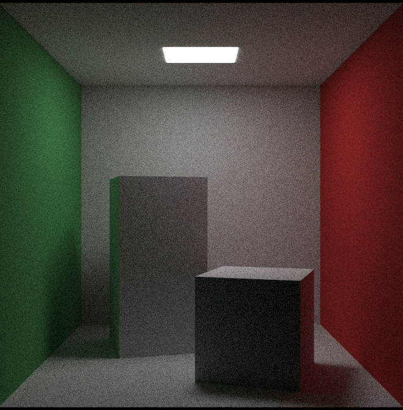
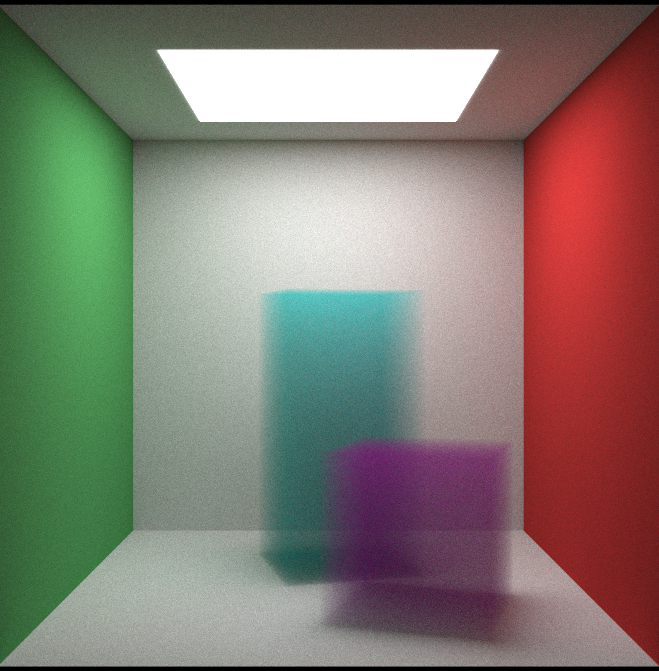

# gpu_raytracing

This repository is an implementation of ray tracing with CUDA.

The source codes are mainly based (some parts, e.g., noise, are chatGPT support) on ray tracing one weekend series [link](https://raytracing.github.io/), but written in the CUDA with OpenGL (for visualization purposes).

Also, I checked [nvidia's technical blog](https://developer.nvidia.com/blog/accelerated-ray-tracing-cuda/) for reference.

If you have questions or suggestions, please feel free to comment on the GitHub issues.

## How to run?

```bash
cd src
make
```

Then,

```bash
./main
```

Generated scenes (See main.cu).

- #include"scene_cornell_box.cu"
  

- #include"scene_cornell_smoke.cu"
  
